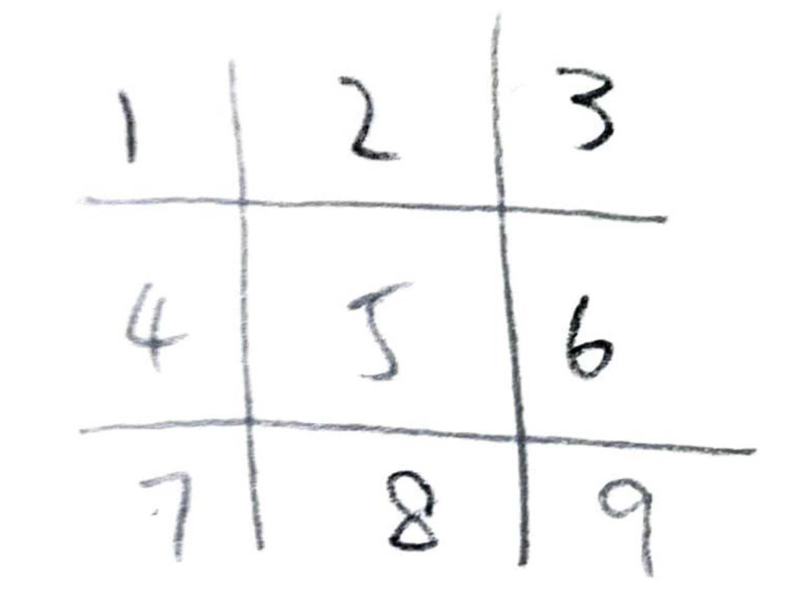

# TicTacToe

## Introduction

This project is intended to create a TicTacToe game using Java. TicTacToe game is popular worldwide with its simple rule. Two players each choose one of the two symbols (usually "X" and "O") to represent its side in a game board made of nine grids. Each round one player put down one's symbol on one of the grid. The game continues until one player wins. A win happens when one player successfully has the same symbol line up horizontally, vertically or on the two diagonal lines. 

The project is not intended to create a TicTacToe game for human versus computer, but a game for two people to play continuously on a screen without the need to write new grids on pieces of paper. 

With that in mind, the following records the process and procedures of how this game come into being on the screen using Java. 

(1) ###Design of Game Board

Since the TicTacToe game board is in the form of a matrix with rows and columns. A 2D array of character is used to design the board so that presents a grid consisting of nine squares on the screen. Instead of simply an array or arraylist data structure, a 2D array allows to make rows and columns easily.  

(2) ###Variables

Two global variables "player1PosSet" and "player2PosSet" is created to store all the position that players mark on the game board. This two Arraylist variables allows the program to make use of the position to determine winners and potential conflicts when placing marks.

(3) **Main**

The program begins with the game board displayed on screen. A prompt appears to ask player 1 to enter their mark on the screen, then follows by a prompt for player 2 to enter their position. 
Inside the program: After player 1 enter their number, the Scanner class store that number in variable _posOne_. The program then check to see if the position corresponding to the number has been taken or not. If so, the program will prompt player 1 to enter another number until the position corresponding to the number is available to place the mark. 
Then, the position for player 1's mark is added to the set that keep track of the all position player 1 has mark on. The number is also translated into a mark on the actual game board. The _checkWinner_ method is then call to see if player 1 has a winning pattern by that point. The _checkFull_ method is called after that to see if there is additional space on the game board. The same process for player 2.  

(4) **Methods**

1. _showGameBoard_ - This method is used to print out the game board on the console place before the game start and after each player place their mark. Since the board must be constantly updated so that players know what places have been taken and think of strategy to win the game based on the current game board situation. To make printing the game board as a method allows the main methods to be more clean and organized. 
2. _checkTaken_ - This method allows the program to determine whether the number entered by the player has been taken previously or taken by the other player already. The purpose is to prevent overwriting the marks that already place on the game board so that there is a finite trials to determine if a winner will emerge or not. The checkTaken methods use the global variables to make the decision. 
3. _checkFull_ - This method is used to check if the game board is full or not. The game board consist of only 9 squares, meaning that there is no more available space on the game board after nine tries. This method allows the program to determine when the game ends. 
4. _playerOnePos_ - This method translates the number that player one enter into the marks on the game board on screen. It uses a switch statement to determine the result for the nine cases (1-9). It also allows to check if player One enter a number between one and nine or not. 
5. _playerTwoPos_ - Similar implementation as method "playerOnePos". This method is for player two. 
6. _checkWinner_ - This methods use to determine the winner of the game. The eight ways for a player to win in TicTacToe is stored in an ArrayList local variable. To determine if there is a winner each round, the global variable that stores position set for each of the two player is compared with the winning sequence to determine if one of them wins or not. The game ends immediately when a player is found. If no player wins the game after the game board is full, then there is a tie. 